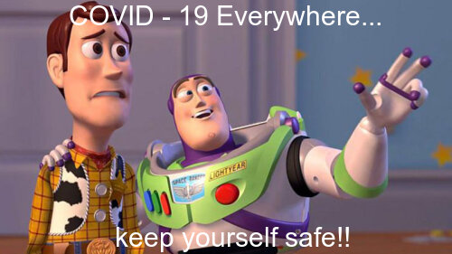

# Welcome! 
Welcome to my website about Covid-19!

## what is Covid -19

Coronavirus disease (COVID-19) is an infectious disease caused by the SARS-CoV-2 virus.
Most people who fall sick with COVID-19 will experience mild to moderate symptoms and recover without special treatment. However, some will become seriously ill and require medical attention.

## How it spreads

The virus can [spread](https://www.who.int/news-room/questions-and-answers/item/coronavirus-disease-covid-19-how-is-it-transmitted) from an infected person's mouth or nose in small liquid particles when they cough, sneeze, speak, sing or breathe. These particles range from larger respiratory droplets to smaller aerosols.

You can be infected by breathing in the virus if you are near someone who has COVID-19, or by touching a contaminated surface and then your eyes, nose or mouth. The virus spreads more easily indoors and in crowded settings.

## How Prevent the Spread of Covid -19 
- Maintain a safe distance from others (at least 1 metre), even if they don't appear to be sick.
-  a mask in public, especially indoors or when physical distancing is not possible.
- Choose open, well-ventilated spaces over closed ones. Open a window if indoors.
- Clean your hands often. Use soap and water, or an alcohol-based hand rub.
- Get vaccinated when it's your turn. Follow local guidance about vaccination.
- Cover your nose and mouth with your bent elbow or a tissue when you cough or sneeze.
  Stay home if you feel unwell.
  
## The Covid has spread around the World! Keep safe yourself from Covid

**_I made this meme for People know COVID-19 is really serious around the world at this present and they should protecting themselves from this COVID - 19.!!_**

I used this toy story background which is from internet, because this background seems expressed like look around how much spread the Covid-19 in the world. And I added the comments on this background myself to looked more impact in my new meme!

I made this meme using by the R package [{magick}](https://cran.r-project.org/web/packages/magick/vignettes/intro.html).
